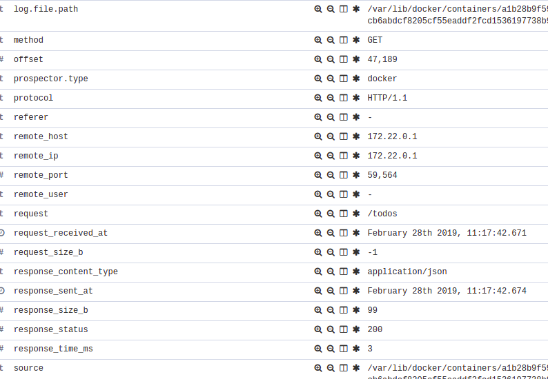

# TODO-API

API para armazenamento e leitura de tarefas

- Criar uma RESTFUL API simples (em sua linguagem preferida) que armazene e atualize tarefas (TODO LIST API). (ex: GET, PUT, POST, DELETE /todo)

## Sobre

- [x] Toda tarefa possui um status (pending ou completed)
- [x] A API persiste os dados em um banco de dados não-relacional (redis)
- [x] A API disponibiliza uma rota para listagem das tarefas e seu status (GET /todos)
- [x] A API fornece uma rota para validar o funcionamento de seus componentes (GET /healthcheck)
- [ ] A API fornece uma rota com indicadores de performance da API (ex: volume de requisições atendidas, tempo médio de serviço em milisegundos, etc) (GET /metrics)

## Uso

GET

```bash
curl http://localhost:5000/todos
```

Saída:

```json
[
    {
        "id": 1,
        "status": "pending",
        "task": "comprar um carro"
    },
    {
        "id": 3,
        "status": "pending",
        "task": "comprar computador"
    }
]
```

POST

```bash
curl -X POST http://localhost:5000/todos -d "task=comprar uma moto" -d "status=pending"
```

Saída:

```json
{
    "task": "comprar uma moto",
    "status": "pending",
    "id": 1
}
```

PUT

```bash
curl -X PUT http://localhost:5000/todos/1 -d "task=comprar um carro" -d "status=completed"
```

Saída:

```json
{
    "id": 1,
    "task": "comprar um carro",
    "status": "completed"
}
```

DELETE

```bash
curl -X DELETE http://localhost:5000/todos/1
```

## Deploy local

Para testar localmente basta ter o docker e docker-compose instalado em sua máquina e rodar o seguinte comando:

```bash
docker-compose up --build
```

## Deploy swarm manual

Poderá utilizar a seguinte estratégia:

Primeiro realize o build da imagem e jogue para algum registry:

```bash
docker login <registry url>
docker build -t todo-list-api:1.0 .
docker push todo-list-api:1.0
```

Dentro de algum dos managers realize o deploy da aplicação:

```bash
docker service create --name "todo-list-api" todo-list-api:1.0
```

Ou para atualizar o serviço:

```bash
docker service update --image todo-list-api:2.0 "todo-list-api"
```

## Deploy swarm auto

Poderá relizar o deploy pelo Jenkins utilizando o tipo 'pipeline' e escolher o Jenkinsfile como build mode. Basta alterar o arquivo jenkins/vars.sh com seus devidos atributos, como registry, swarm host e etc.

Depois é só clicar em "Build now"

Claro, a melhor prática é coletar essas informações em um sistema de armazenamento de variáveis, como Consul ou Vault.. Mas pra uma stack local até que ta bom.

## Monitor

Poderá utilizar a stack filebeat+logstash+elastic+kibana para coletar os logs dessa aplicação e de outras do seu cluster. Basta subir o docker-compose-monitor.yml. Mas cuidado, se a máquina não for boa irá sobrecarregar o seu sistema. Comando:

```bash
docker-compose up --build -f docker-compose-monitor.yml
```

Depois basta rodar alguns comandos com get, put ou whatever e ele irá aparecer no Elasticsearch no index com pattern logstash-*.  
Entre no Kibana no endereço <http://127.0.0.1:5601/>, vá em Discover > Create index pattern e digite `logstash-*` e clique em Next step.  
Escolha @timestamp como **Time Filter field name** e para finalizar clique em "Create index pattern".  

Agora é só clicar em Discover e ver os logs da aplicação. Simples.

Exemplo de log:


